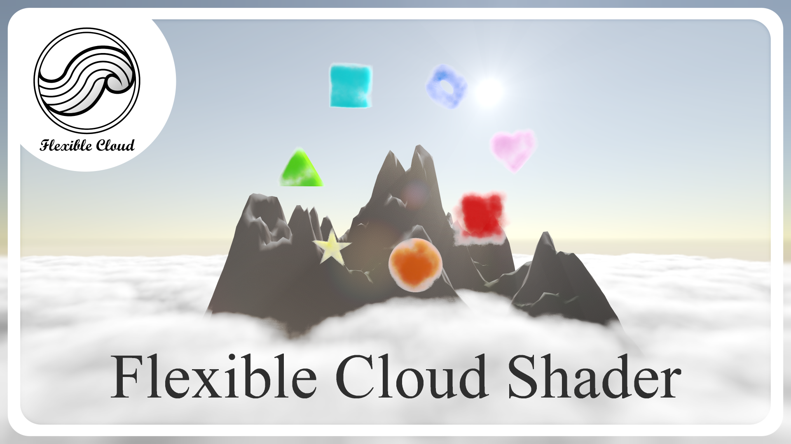
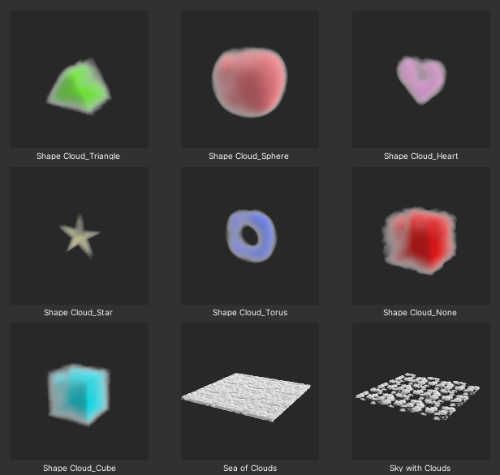
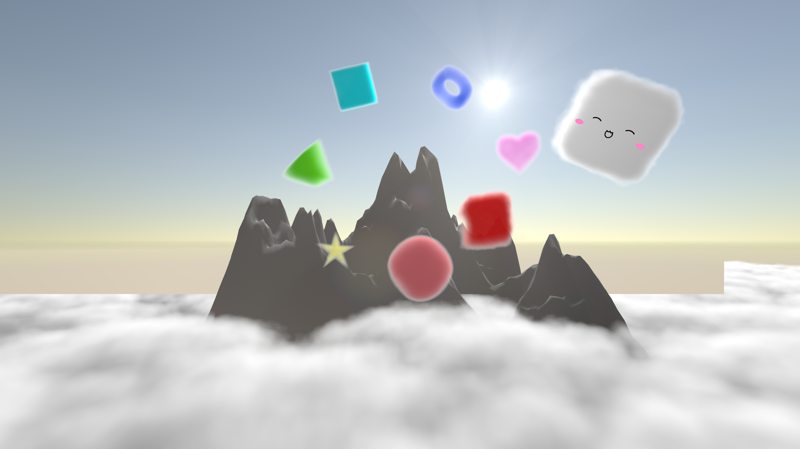
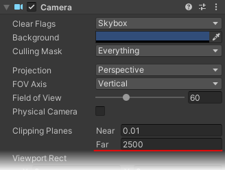
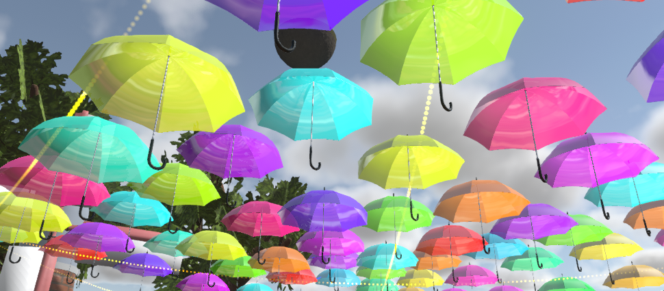
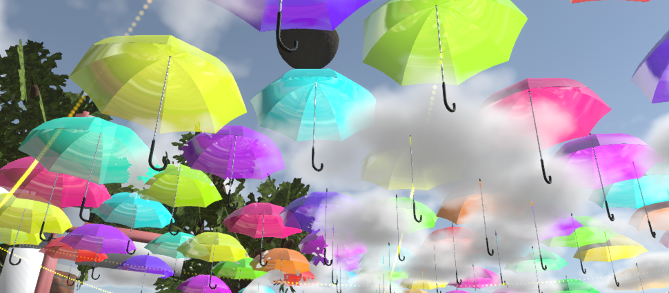
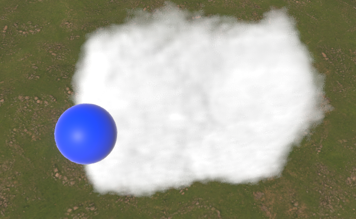
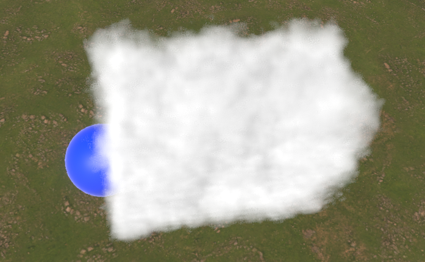
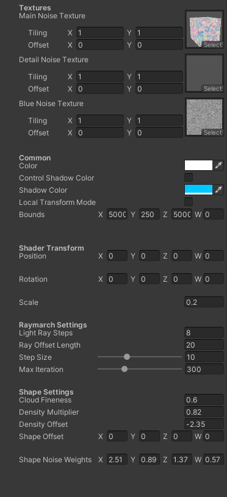
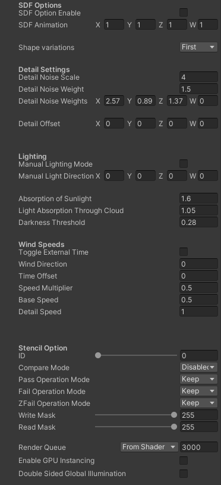

# Flexible Cloud Shader(FCS)
  
物理ベースのVolumetricで綺麗な雲を描画するShaderです！  
分かりやすく説明すると、3Dモデルデータ等で使用されているメッシュのように表面のみの描画ではなく、中身の詰まった雲を描画できます！  
そのため、Skyboxに描かれている雲とは違って立体的で、より実在感があります！  
本Shaderの大きな特徴として、形と大きさを自由自在に操作できる機能を搭載しています！  
## 使い方
### 1.設置方法
  
商品購入後に同封されているunitypackageを使用するUnityのプロジェクトに取り込み、
> Assets/Appletea's Item/Flexible Cloud Shader/[バージョン]/Prefab

フォルダ内のPrefabをSceneに配置してご利用ください。
各Prefabの詳細を以下に示します。

- Sea of Clouds.prefab
雲海を表現する場合にご利用ください。

- Sky with Clouds.prefab
空の雲を表現する場合にご利用ください。

- Shape Cloud_[種類].prefab
アクセサリーなどの用途にご利用ください。

### 2.⚠️重要⚠️ 使用上の注意
本商品を使用するためにいくつか注意すべき点があります。

1. SceneのDepth Texture発行に関して  
本商品のShaderはUnityの深度情報を利用しているため、使用する際は
	- Directional Light (Realtime Mode, Shadow)
	- [VUdon - Depth Buffer Toolkit](https://github.com/Varneon/VUdon-DepthBufferToolkit)  
のような手段でDepth Textureを発行してください。
この仕様上、VRSNS上のアクセサリーなどアバターに使用にする場合は利用できないワールドがあるため注意してください。

	本来、VRChatの利用できないワールドで表示を切り替える設定を入れているのですが、VRChatのバグによって適切に切り替わらない問題があるため[バグ修正の投票](https://feedback.vrchat.com/bug-reports/p/vrc-camera-emits-inaccurate-depth-texture)にご協力ください。

2. Cameraのクリッピング距離の設定

	  

	大きな雲を設置する場合にCameraのクリッピング距離を超えてしまい、正常に描画されない場合があるため

	  

	**Clipping PlanesのFar**を十分な距離に設定してください。

3. 透過オブジェクトとの干渉

	| RenderQueue:3000 | RenderQueue:4000 |
	|---|---|
	|||
	|||

	雲が大きい透過オブジェクトであるため、Unityの仕様上他の透過オブジェクト(RenderQueueがTransparentのもの)との干渉が発生します。
専門的な話をすると、本ShaderはZ Bufferを読んで深度計算を正確にしますが、TransparentのオブジェクトはZ Bufferに深度を書き込まないため、Mesh Rendererの前後関係から描画順を決定するUnityの仕様に頼らざるを得ないといった感じです。
そのため、雲の描画を常に優先するか、遠方の前後関係を優先するかは設定を変更して決定してください。  
デフォルト設定では、遠方の前後関係を優先するためRenderQueueが3000に設定されています。  
雲の描画を常に優先する場合はRenderQueueを4000程度に設定してください。  

### 3.Shaderの設定項目の説明
**注意！アップデートで項目が変更される場合があります！**

|||
|---|---|

デフォルト設定から変更する必要があまりない項目については解説を省いています。  
また、角度設定はすべてradianです。

- Textures  
この項目では雲生成に使うNoiseを読み込ませます。仕様を理解して自分でTextureを描ける猛者以外はPrefabのデフォルト状態で利用してください。
- Common
雲の共通設定です。
	- Color・Shadow Color  
	雲全体の色と影色の設定です。
	- Control Shadow Color  
	影色を変える場合のみチェックを入れてください。
	- Local Transform Mode  
	Position、Rotation、Scaleをオブジェクトに追従させたい場合はチェックを入れてください。  
	チェックを入れた際にオブジェクトのScaleに従うようになるため**Shader TransformのScaleを調整**してください
	- Bounds  
	雲を描画する範囲です。オブジェクトの描画範囲内に収まるように設定してください。
- Shader Transform  
Shader側でPosition、Rotation、Scaleを調整できます。
	- **Scale**  
	見た目を変えずに拡大縮小できます。非常に小さい雲も正確に生成できます。
- Raymarch Settings  
描画計算の設定です。
	- Ray Offset Length  
	大きくすることで、見た目の歪みをJitterに肩代わりさせて綺麗に見せることができます。  
	大きくし過ぎると常にノイズが見えるため、9～30程度の範囲で使うことをおすすめします。
	- Step Size  
	小さくするほど計算が細かくなり綺麗になりますが、負荷が増加します。
	- Max Iteration  
	大きくするほど遠くの雲が途切れないようになりますが、負荷が増加します。  
	通常用途では150程度、雲海や空の雲に使う場合は1000以下をおすすめします。
- Shape Settings  
雲の形に関する設定項目です。
	- Cloud Fineness  
	雲の細かさです。使用しているNoise Texture拡大率なので、大きくすると繰り返しが発生します。
	- **Density Offset**  
	小さくすると雲の密度が下がり、大きくすると増加します。雲の発生と消失の表現に利用できます。
	- Shape Noise Weights  
	Main Noise Textureの各チャンネルのBlend度合いを設定します。
- SDF Options  
雲の形を加工するためのオプションです。
	- SDF Option Enable  
	形の変形を有効化する場合にチェックを入れてください。
	- SDF Animation  
	それぞれの形に割り当てられた固有のパラメータを操作できます。
	- Shape variations  
	6種類の形を選択できます。デフォルトでは、
		- Sphere : 球
		- Cube : 四角
		- Triangle : 三角
		- Torus : ドーナツ
		- Heart : ハート
		- Star : 星  
	が選択できます。
- Detail Settings  
雲の細かな凹凸に関する設定です。
	- Detail Noise Weight  
	細かな凹凸の大きさです。大きくすると雲が侵食されます。
	- Detail Noise Weights  
	Detail Noise Textureの各チャンネルのBlend度合いを設定します。
- Lighting  
光源の影響や雲の光学的設定です。
	- **Manual Lighting Mode**  
	手動で光源位置を設定し、光源の色を反映しないモードです。  
	**複数Lightが存在する環境では必ず使用してください。**
	- Manual Light Direction  
	光源が存在しない場合や手動設定の場合の光源方向を定義します。  
	X、Y、Z軸の回転角で操作します。
- Wind Speeds  
風による雲の流れに関する設定です。
	- **Toggle External Time**  
	**通常、Shader内の時間はScene読み込みからの時間で、VRSNSなどの複数人で利用する環境下で同期されないため、外部ScriptやAnimationで操作する場合はチェックを入れてTime Offsetに時間を書き込んでください。**
	- Wind Direction  
	風向きを水平方向の角度で変更できます。**UVスクロールで実装している都合上、使用中の変更はちらつきが発生するため推奨しません。**
	- Time Offset  
	通常時は時間を加算するだけですが、**Toggle External Time**が有効になっている場合は現在の時間の設定になります。
	- Speed Multiplier  
	時間倍率の設定です。
	- Base Speed  
	雲本体の動きの速度設定です。
	- Detail Speed  
	雲の細かな凹凸の流れの速度設定です。風速が異なる部分の巻き上げを表現できます。
- Stencil Option  
Stencil設定に対応しています。分かる人はご利用ください。
- RenderQueue  
先述した通り、デフォルトは3000に設定されていますが、必要に応じて4000に変更してください。
- Enable GPU Instancing  
GPU Instancingに対応しています。複数の全く同じMeshで同じMaterialの雲を使う場合にご利用ください。

